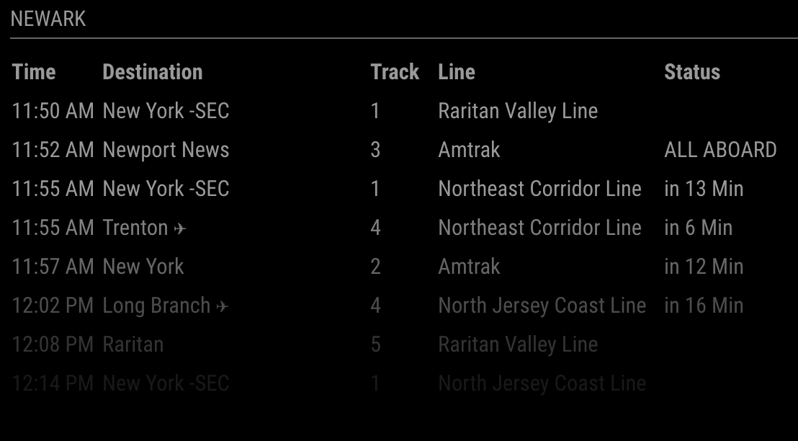

# MagicMirror Module: NJ Transit Rail Service
`MMM-NJT-Rail` is a module for the [MagicMirror](https://github.com/MichMich/MagicMirror). It displays departures for a given Train Station.




# Usage
## Installation
### 1. Clone this module into your MagicMirror's `modules` directory
```bash
cd modules && 
git clone https://github.com/KevinAnthony/mmm-njt-rail.git
```

### 2. Install this module's dependencies
```bash
cd mmm-njt-rail &&
npm install --production
```

### 3. Add this module to your MM config's `modules` array
```bash
cd ../.. && 
vi config/config.js
```

config values:
| value      | Description | Default Value |
| ----------- | ----------- |---------|
|station| Station name, taken from [NJT Departure Vision](https://www.njtransit.com/dv-to) NOTE: this is case-sensitive.|New York Penn Station|
|fadePoint| At which point down the list should the list start fading to nothing, set to 1 for no fade. | .25|
|maxShown| How many rows of departures should be shown, set to 0 for all. | 0|
|refreshInterval| How often should thee information be refreshed, in seconds. | 60|
